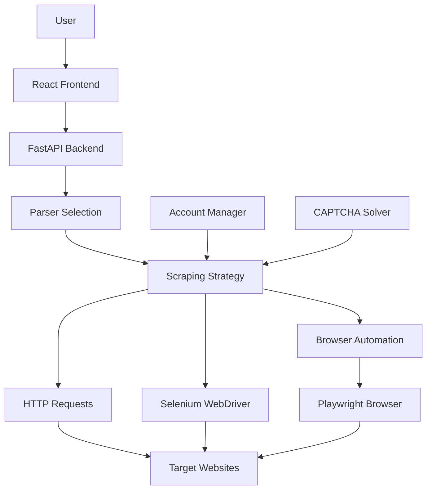

# Project Architecture Documentation

## Overview
This is a web scraping service for extracting reviews and procurement information from various Russian government and commercial platforms. The system provides a REST API with a React frontend for user interaction.

## Core Components

### 1. Backend API (FastAPI)
- **Main Entry Point**: `app/main.py`
- **Framework**: FastAPI for asynchronous API handling
- **Key Features**:
  - RESTful endpoints for scraping operations
  - CORS support for frontend integration
  - Lifecycle management for browser instances

### 2. Scraping Engine
- **Location**: `app/services/scraper_engine.py`
- **Functionality**:
  - Multi-strategy scraping approach (request-based, browser-based, Selenium)
  - Platform-specific parser selection
  - Cloudflare and anti-bot protection bypass mechanisms
  - Account rotation and proxy management
  - CAPTCHA detection and solving

### 3. Parser System
- **Base Parser**: `app/services/parsers/base.py`
- **Platform-Specific Parsers**:
  - Zakupki.gov.ru (`app/services/parsers/zakupki.py`)
  - Roseltorg.ru (`app/services/parsers/roseltorg.py`)
  - RTS-tender.ru (`app/services/parsers/rts_tender.py`)
  - Sberbank-AST.ru (`app/services/parsers/sberbank_ast.py`)
  - Avito.ru (`app/services/parsers/avito.py`)
  - Books.toscrape.com (`app/services/parsers/books_toscrape.py`)
  - Quotes.toscrape.com (`app/services/parsers/quotes.py`)

### 4. Core Services

#### Account Management
- **File**: `app/core/accounts.py`
- **Features**:
  - JSON-based account storage (`app/accounts.json`)
  - Account rotation for scraping
  - Profile generation with realistic user data

#### Browser Automation
- **File**: `app/core/browser.py`
- **Features**:
  - Playwright integration for browser automation
  - Device emulation (mobile/desktop)
  - Proxy configuration per account
  - Cookie injection for session persistence

#### Network Handling
- **File**: `app/core/network.py`
- **Features**:
  - DNS resolution checking
  - TLS fingerprinting with curl_cffi
  - JA3/JA4 fingerprinting for bot detection avoidance

#### Stealth Mechanisms
- **File**: `app/core/stealth.py`
- **Features**:
  - WebDriver property masking
  - Plugin and language spoofing
  - WebGL and Canvas fingerprinting prevention
  - Geolocation spoofing
  - Hardware concurrency simulation

#### Humanization
- **File**: `app/core/humanization.py`
- **Features**:
  - Human-like scrolling simulation
  - Mouse movement emulation
  - Login automation for supported platforms

#### CAPTCHA Solving
- **File**: `app/core/captcha.py`
- **Features**:
  - CapSolver integration for automated solving
  - ReCaptcha v2 support
  - Cloudflare Turnstile support
  - Automatic detection and solving

### 5. Frontend (React)
- **Framework**: React with Vite
- **Key Components**:
  - Platform selection interface
  - Filtering options for searches
  - Results display with pagination
  - History tracking with localStorage
  - Progress indicators and error handling

### 6. Configuration and Deployment

#### Docker Configuration
- **Files**: `Dockerfile`, `docker-compose.yml`
- **Features**:
  - Multi-container setup (API + Frontend)
  - Playwright and Chrome installation
  - Tor integration for additional anonymity
  - Volume mounting for development

#### Dependency Management
- **File**: `pyproject.toml`
- **Key Dependencies**:
  - FastAPI for API framework
  - Playwright for browser automation
  - BeautifulSoup4 for HTML parsing
  - Pydantic for data validation
  - curl-cffi for network requests
  - Selenium for additional browser automation
  - CapSolver for CAPTCHA solving

## Data Flow

1. **User Request**: User submits scraping request via frontend
2. **Request Processing**: API validates and processes request
3. **Parser Selection**: Scraper engine selects appropriate parser
4. **Account Selection**: Random account selected for rotation
5. **Scraping Strategy**: Appropriate method chosen (request/browser/Selenium)
6. **Anti-Bot Handling**: Stealth, humanization, and CAPTCHA solving applied
7. **Data Extraction**: HTML parsed and structured data extracted
8. **Response**: Results returned to frontend for display

## Supported Platforms

1. **Zakupki.gov.ru** - Government procurement platform
2. **Roseltorg.ru** - Agricultural trading platform
3. **RTS-tender.ru** - Multi-sector tender platform
4. **Sberbank-AST.ru** - Banking sector procurement
5. **Avito.ru** - Classified ads platform
6. **NEP** - Nuclear energy procurement
7. **Test Platforms**:
   - Books.toscrape.com
   - Quotes.toscrape.com

## Security and Anti-Detection Features

1. **Browser Automation**:
   - Playwright with stealth.js integration
   - Device emulation for mobile/desktop browsing
   - User agent rotation

2. **Network Level**:
   - TLS fingerprinting with curl_cffi
   - JA3/JA4 fingerprint spoofing
   - Proxy support for IP rotation

3. **Human Behavior Simulation**:
   - Mouse movement emulation
   - Scrolling behavior simulation
   - Random delays and interactions

4. **CAPTCHA Handling**:
   - Automatic detection
   - Integration with CapSolver service
   - Support for multiple CAPTCHA types

## Deployment Architecture

## Key Features

1. **Multi-Platform Support**: Handles various Russian procurement and commercial platforms
2. **Advanced Anti-Detection**: Multiple layers of bot detection avoidance
3. **Flexible Scraping Strategies**: Automatic selection of best approach per platform
4. **Account Rotation**: Multiple account support with rotation for rate limiting avoidance
5. **Filtering System**: Platform-specific filtering capabilities
6. **Progressive Enhancement**: Fallback strategies if primary methods fail
7. **History Tracking**: Local storage of previous searches
8. **Responsive UI**: Modern React-based interface with real-time feedback

## Technical Stack

### Backend
- Python 3.10+
- FastAPI (ASGI framework)
- Playwright (browser automation)
- BeautifulSoup4 (HTML parsing)
- curl-cffi (network requests)
- Selenium (additional browser automation)
- CapSolver (CAPTCHA solving)

### Frontend
- React 18+
- Vite (build tool)
- JavaScript/JSX

### Infrastructure
- Docker (containerization)
- Docker Compose (multi-container orchestration)
- Tor (optional anonymity)
- Chrome/Chromium (browser automation)